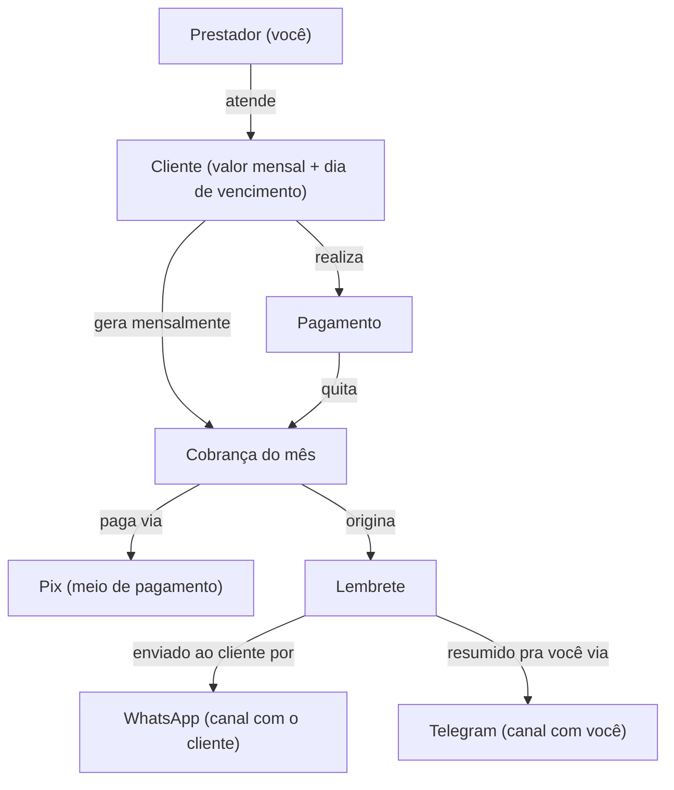
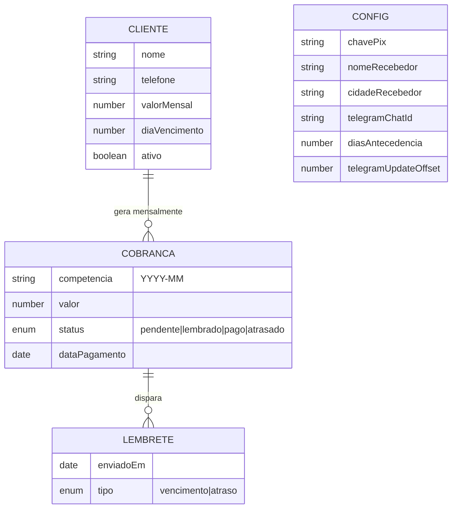
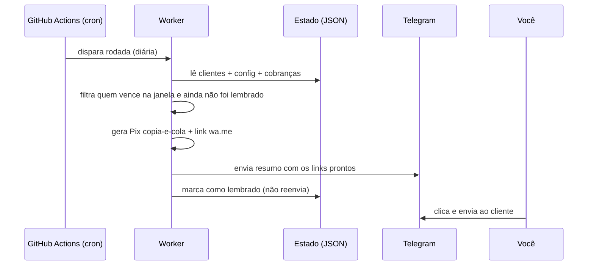
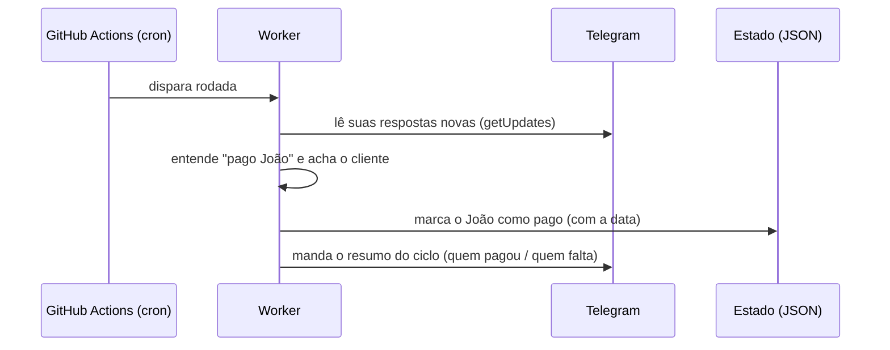

# Lembrete de Cobrança Mensal — Plano de Concepção

> Documento humanizado (HDoc), **derivado do LDoc** (`ldoc.md`). Para ler,
> revisar e aprovar. Não editar como fonte — mudanças entram no LDoc e este é
> regenerado.

## O produto, em uma frase

Um robozinho que, todo mês, descobre quais clientes estão para vencer, **monta
a cobrança (Pix) e a mensagem prontas**, e te entrega tudo no Telegram — você só
clica e envia pelo WhatsApp.

## De onde vem (a dor)

Você presta um serviço mensal para poucos clientes (1–10). O problema não é
*esquecer* que o mês virou — é o **trabalho manual repetitivo**: montar a
mensagem, gerar o Pix com o valor certo, mandar para cada cliente e depois
controlar quem pagou. É chato e fácil de deixar escapar.

A solução foi desenhada para custar **R$ 0 em serviços**: sem provedor de
pagamento, sem API paga do WhatsApp. Pix gerado offline, WhatsApp por link de
1 clique, agendamento no GitHub Actions (grátis) e operação pelo Telegram.

## Como as peças se encaixam (conceitos)

## Como os dados se organizam (DER amplo)

Cada cliente tem **um valor mensal**. A cada mês nasce uma **Cobrança** (uma por
competência). O pagamento é confirmado **na mão** (vira `status=pago` na
cobrança — não há tabela de pagamento). Cada cobrança guarda o **histórico de
lembretes** enviados. A configuração (chave Pix, recebedor, Telegram) é global.

## Roadmap — por que esta ordem

| Inc | Nome | O que entrega | Cobre |
|---|---|---|---|
| **1** | Lembrete com 1 clique | O coração da dor: gera Pix + mensagem e te manda no Telegram pra enviar com 1 clique. | CU1(básico), CU2, CU3, CU4 |
| **2** | Controle de pago/devendo | Você marca "pago" no Telegram; o resumo mostra quem pagou e quem falta. | CU5, CU6 |
| **3** | Ciclo automático + atrasados | Vira o mês sozinho e re-cobra quem atrasou. | CU7, CU8 |
| **4** | Gestão de clientes pelo bot *(futuro)* | Cadastrar/editar cliente conversando com o bot. | CU1(completo) |

**A lógica da sequência:** o Inc 1 ataca primeiro o que mais dói e dá pra fazer
ponta a ponta com o mínimo — *gerar e enviar*. Marcar pagamento e controle
(Inc 2) só fazem sentido depois que os lembretes já saem. Tirar você do
operacional recorrente (Inc 3 — ciclo e atrasados) é otimização sobre uma base
que já funciona. A gestão pelo bot (Inc 4) é conforto, fica em baixa resolução
de propósito — detalhar agora seria compromisso prematuro.

## O Incremento 1 na prática (estado inicial → resultado)

**Antes:** seu `clientes.json` tem o João (R$ 150, vence dia 10). Hoje é 07/06 e
você configurou avisar com 3 dias de antecedência.

**A rodada agendada roda e:**

**Depois:** chega no seu Telegram um resumo com **João — R$ 150,00**, o **link do
WhatsApp** com a mensagem pronta e o **Pix copia-e-cola** já com o valor. Você
clica, envia, e pronto. Se a rodada rodar de novo no mesmo dia, o João **não**
recebe de novo.

## O Incremento 2 na prática (estado inicial → resultado)

**Antes:** o João (R$ 150) e a Maria (R$ 200) já foram lembrados neste mês. Você
recebeu o cliente João no Pix e, no Telegram, respondeu **`pago João`**.

**A próxima rodada roda e:**

**Depois:** chega no seu Telegram o resumo do mês, mostrando o ciclo inteiro de
relance:

> 📊 **Ciclo 06/2026**
> ✅ **João Silva** — R$ 150,00 *(pago 19/06)*
> ⏳ **Maria Souza** — R$ 200,00 *(devendo)*

Você marca pagamento **respondendo no Telegram**, sem sair do app, e enxerga num
relance quem ainda falta. Se houver dois clientes com o mesmo nome, o robô pede
pra você especificar; sua resposta é lida na rodada seguinte.

## Pontos a resolver na implementação

1. Chave Pix e token do Telegram em **secret** (não no JSON versionado); cuidar da PII dos clientes (repo privado).
2. Idempotência (cron pode rodar várias vezes/dia).
3. Cadência do cron × janela de 24h do Telegram `getUpdates` — **endereçado no desenho do Inc 2**: a rodada lê os updates com offset persistido e, rodando ≥1x/dia, cobre a janela sem servidor sempre-ligado.
4. Fuso horário (GitHub Actions roda em UTC).
5. Virada de ciclo automática (entra no Inc 3).
