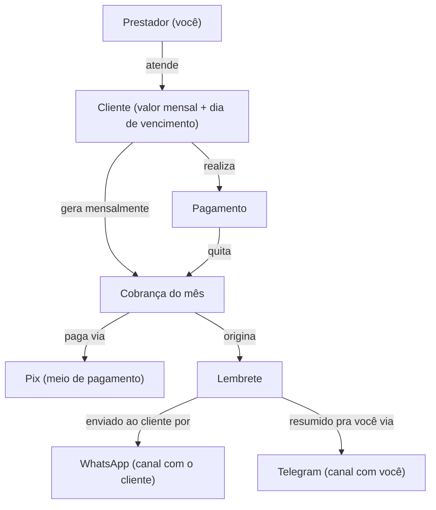
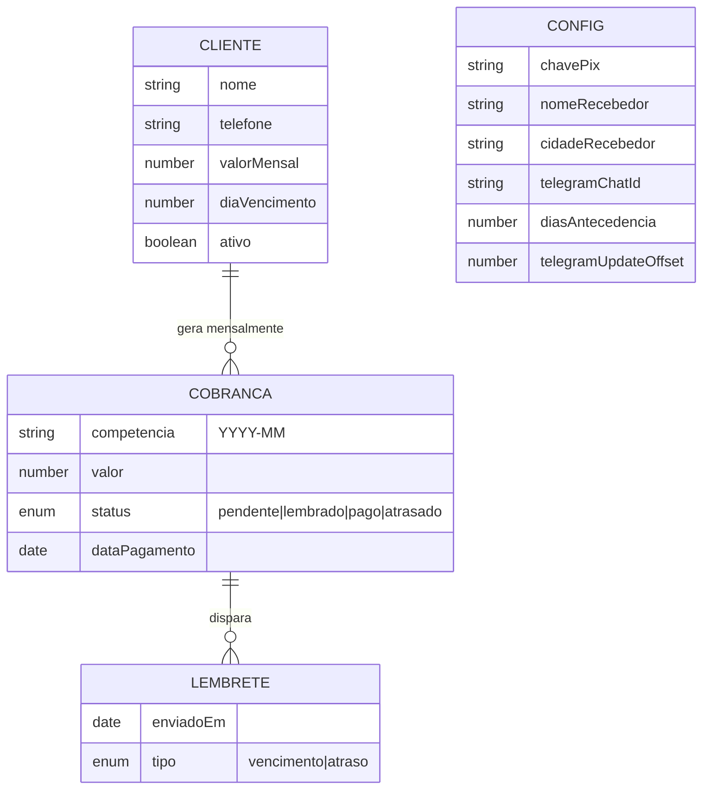

# LDoc — Lembrete de Cobrança Mensal

> Fonte da verdade (LLM-first) do Estágio 1 (conceituação). O HDoc é derivado deste documento.
> Projeto de demonstração do pipeline, gerado na branch `teste`.

## Dor de origem

Prestador de serviço com poucos clientes (1–10) tem trabalho operacional
repetitivo todo mês: **gerar a cobrança, enviar o lembrete e controlar quem
pagou**. A dor não é memória (não esquece que o mês virou) — é o *trabalho
manual* de montar mensagem + Pix e acompanhar pagamentos.

## Decisões de arquitetura (do discovery / kickoff)

| Decisão | Escolha | Porquê |
|---|---|---|
| Stack | TypeScript + Node, perfil `profile-cli` | Sem UI; é um worker agendado. |
| Pagamento | Pix manual, confirmação na mão | Zero PSP, zero taxa. |
| Geração do Pix | Copia-e-cola (BR Code EMV) gerado offline com valor | Sem provedor, sem custo. |
| WhatsApp | Semi-automático (link `wa.me`, 1 clique) | Grátis, sem risco de ban, sem burocracia Meta. |
| Agendamento | GitHub Actions cron (grátis, nuvem) | Sem máquina sempre-ligada. |
| Notificação/operação | Telegram bot | Resumo com links + marcar "pago" respondendo. |
| Dados | Arquivo JSON versionado | 1–10 clientes; estado commitado pelo Action. |

### Restrição de desenho

GitHub Actions é job curto, não "ouve" o Telegram. A cada run o job lê as
mensagens novas via `getUpdates` (processa "pago X" desde a última run),
recalcula e envia o resumo. Rodando ≥1x/dia, cobre a janela de 24h do
`getUpdates` sem servidor sempre-ligado.

## (a) Diagrama de conceitos

Decisão de conceito: **um valor por cliente** (sem entidade "Serviço" separada).

## (b) Casos de uso

| # | Caso de uso |
|---|---|
| CU1 | Manter a lista de clientes (nome, telefone, valor mensal, dia de vencimento) |
| CU2 | Ser avisado, no Telegram, das cobranças que estão vencendo |
| CU3 | Enviar o lembrete ao cliente com 1 clique (link `wa.me` + mensagem pronta) |
| CU4 | Gerar o Pix copia-e-cola com o valor já embutido (offline) |
| CU5 | Marcar um cliente como "pago" respondendo no Telegram |
| CU6 | Acompanhar quem já pagou e quem ainda deve no ciclo |
| CU7 | Virar o ciclo mensal automaticamente (nova cobrança pendente a cada mês) |
| CU8 | Re-cobrar quem passou do vencimento sem pagar (atrasados) |

## (c) Roadmap de incrementos

| Inc | Nome | Valor agregado | Cobre |
|---|---|---|---|
| 1 | Lembrete com 1 clique (MVP) | Sistema roda, descobre quem vence, monta Pix + mensagem + link `wa.me` e manda no Telegram. Você só clica e envia. | CU1(básico), CU2, CU3, CU4 |
| 2 | Controle de pago/devendo | Marca "pago" respondendo no Telegram; resumo mostra quem pagou e quem falta. | CU5, CU6 |
| 3 | Ciclo automático + atrasados | Virada de mês gera cobrança nova; vencidos sem pagar viram atrasados e ganham re-lembrete. | CU7, CU8 |
| 4 (futuro) | Gestão de clientes pelo bot | Cadastrar/editar/desativar cliente conversando com o bot. | CU1(completo) |

Lógica da ordem: Inc 1 entrega o coração da dor (gerar+enviar) ponta a ponta
com o mínimo; Inc 2 fecha o loop de controle; Inc 3 tira o humano do
operacional recorrente; Inc 4 é conforto (baixa resolução de propósito).

## Questões em aberto (herdadas do kickoff)

1. PII em repo git (nome+telefone versionados) — repo privado mitiga; avaliar criptografia.
2. Idempotência do lembrete (cron roda várias vezes/dia).
3. Janela de 24h do `getUpdates` × cadência do cron.
4. Fuso horário (Actions roda em UTC; ajustar p/ BR).
5. Virada de ciclo automática.

---

## DER amplo (aprovado no Gate 1.5)

Estrutural, amplo e raso. Decisões confirmadas por item:
- Sem entidade `Pagamento` — vira `status=pago` + `dataPagamento` na `Cobranca`.
- `Cliente : Cobranca = 1 : N` (uma por competência/mês).
- `Lembrete` é entidade própria (`Cobranca : Lembrete = 1 : N`) — guarda histórico (vencimento + atrasos).
- `Config` é singleton global (chave Pix, nome+cidade do recebedor p/ BR Code, Telegram).

